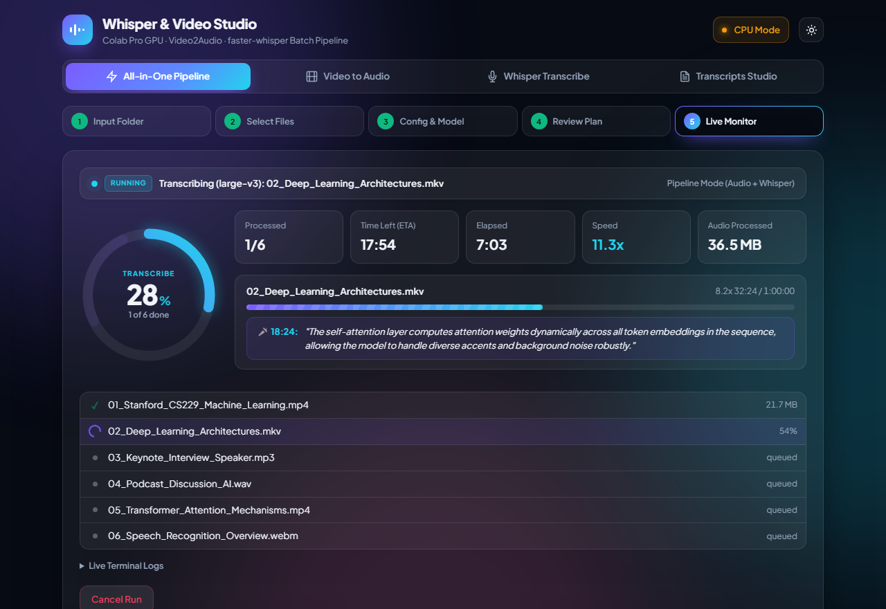
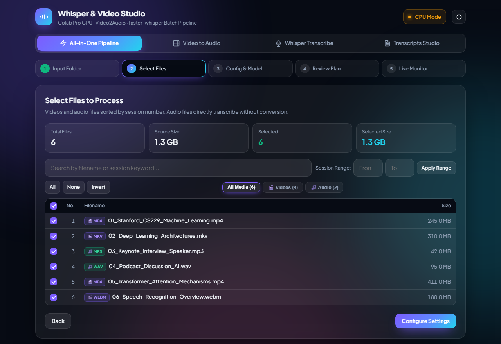
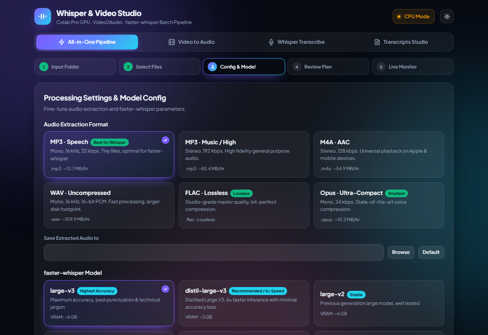
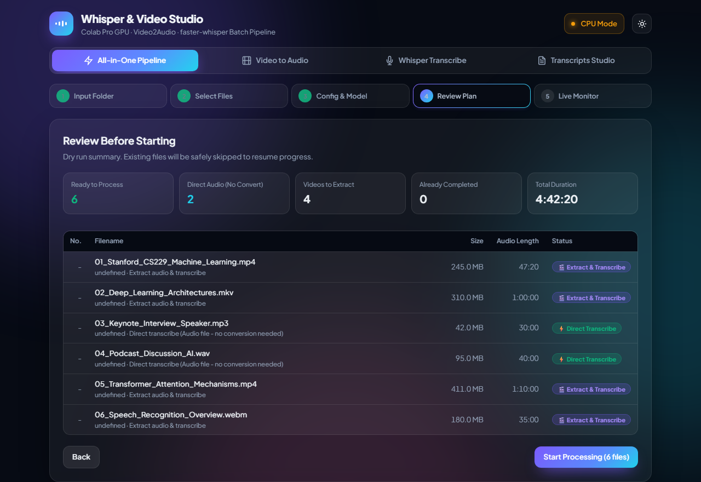
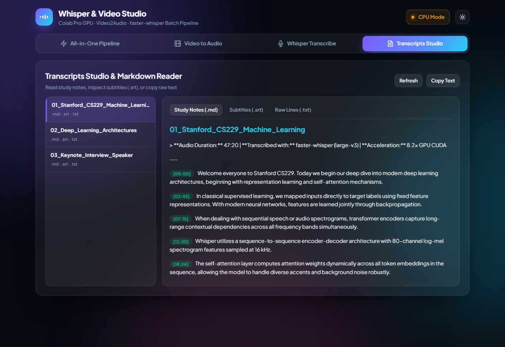

# 🎙️ Whisper & Video Studio

[](https://colab.research.google.com/github/ASHISH213/whisper-video-studio/blob/main/Whisper_Video_Studio.ipynb)
[](https://www.python.org/downloads/)
[](https://github.com/SYSTRAN/faster-whisper)
[](https://developer.nvidia.com/cuda-toolkit)
[](https://ffmpeg.org/)
[](LICENSE)

An all-in-one, GPU-accelerated **Video-to-Audio extractor** and **batch speech-to-text studio** powered by `faster-whisper` and `FFmpeg`. Features an interactive web application that runs seamlessly embedded inside **Google Colab (A100, L4, T4)** or on your **local workstation**.

---



---

## ⚡ Highlights & Key Capabilities

- **🚀 One-Click End-to-End Pipeline**: Feed any folder of media $\to$ auto-extract speech-optimized audio $\to$ batch transcribe with Whisper $\to$ produce `.txt`, `.srt`, and `.md` Study Notes.
- **🎧 Smart Direct Audio Bypass**: Native audio files (`.mp3`, `.wav`, `.m4a`, `.aac`, `.flac`, `.opus`, etc.) **bypass FFmpeg conversion entirely** and feed straight into faster-whisper, saving massive disk space and computation time.
- **🎬 46+ Formats Supported**:
  - **Video (27+ formats)**: `.mp4`, `.mkv`, `.webm`, `.avi`, `.mov`, `.flv`, `.wmv`, `.m4v`, `.ts`, `.mts`, `.m2ts`, `.mpg`, `.mpeg`, `.3gp`, `.ogv`, `.vob`, and more.
  - **Audio (21+ formats)**: `.mp3`, `.m4a`, `.wav`, `.aac`, `.flac`, `.ogg`, `.opus`, `.wma`, `.aiff`, `.alac`, `.mka`, `.ac3`, `.dts`, `.amr`, `.caf`, `.weba`, and more.
- **⚡ Extreme GPU Acceleration**:
  - Native **CUDA 12** integration with cuBLAS & cuDNN runtime hooks.
  - **Batched Inference Pipeline** (`BatchedInferencePipeline`): Decodes speech batches simultaneously, achieving **6x–12x real-time speed** on Google Colab A100 / L4 / T4 GPUs.
- **📊 Refined Live Monitor & Progress Ring**:
  - Geometrically centered circular progress bar with active glowing gradient.
  - Continuous rotating spinner arc (`spinner-arc`) so the ring **never looks frozen** during model loading or between audio batches.
  - Full-width status banner with pulsing beacon, active file tracker, ETA calculator, speed multiplier ($x$), and real-time streaming speech transcription box.
- **📝 Formatted Markdown Study Notes**:
  - Automatically splits speech into readable paragraphs with timestamp badges `[00:15]`.
  - Built-in **Transcripts Studio & Markdown Reader** to view, format, and copy notes without opening external software.
- **🔄 100% Resumable & Safe**:
  - Inspects existing transcripts and audio files; resumes seamlessly without re-transcribing completed sessions.
  - Crash-proof atomic file writes (`.part` staging) protect your transcripts against Colab timeouts or disconnections.

---

## 📸 Visual Tour

### 1. Step 2: Media Scanner & Range Selection
Filter by media type (`All Media`, `Videos Only`, `Audio Only`), search filenames, or specify numeric ranges (e.g. Session 1 to 20):


---

### 2. Step 3: Model Configuration & Audio Presets
Select faster-whisper models (`large-v3`, `distil-large-v3`, `large-v2`, `medium`), audio formats (Speech MP3 32k, Lossless WAV, AAC, Opus), language, and technical hotword prompts:


---

### 3. Step 4: Dry-Run Plan & Smart Bypass Review
Inspect the plan before launching. Video files are scheduled for extraction, while audio files are automatically identified for **Direct Transcribe Bypass**:


---

### 4. Step 5: Live Execution Dashboard
Track real-time progress, speed multiplier, elapsed time, current segment playback, and live speech streaming:


---

### 5. Transcripts Studio & Markdown Reader
Read and copy generated `.md` study notes, inspect `.srt` subtitles, or review `.txt` timestamps directly inside the browser:


---

## 🚀 Quick Start Guide

### Option A: Run on Google Colab (Recommended)

1. Open the notebook in Google Colab:
   [](https://colab.research.google.com/github/ASHISH213/whisper-video-studio/blob/main/Whisper_Video_Studio.ipynb)
2. Switch runtime to GPU: **Runtime $\to$ Change runtime type $\to$ T4, L4, or A100 GPU**.
3. (Optional) In **Colab Secrets** (🔑 icon on left toolbar), add `HF_TOKEN` with your Hugging Face access token.
4. Run **Step 1: One-Click Environment Setup & Drive Mount** (installs PyAV, faster-whisper, and mounts Google Drive).
5. Run **Step 2: Launch Whisper & Video Studio**: The interactive web app will open directly inside your notebook cell!

---

### Option B: Run Locally on Windows / Linux / macOS

#### 1. Prerequisites
- Python 3.9, 3.10, 3.11, or 3.12
- [FFmpeg](https://ffmpeg.org/download.html) installed and added to your system `PATH`
- (Optional, recommended) NVIDIA GPU with CUDA 12 drivers

#### 2. Installation
```bash
# Clone the repository
git clone https://github.com/ASHISH213/whisper-video-studio.git
cd whisper-video-studio

# Create a virtual environment
python -m venv .venv

# Activate virtual environment
# Windows:
.venv\Scripts\activate
# Linux / macOS:
source .venv/bin/activate

# Install requirements
pip install -r requirements.txt
```

#### 3. Run the Studio
```bash
python colab_studio.py
```
The studio will automatically start and launch in your default browser at `http://127.0.0.1:8765/`.

To run without automatically opening the browser:
```bash
python colab_studio.py --no-browser --port 8765
```

---

## ⚙️ Model Comparison & Benchmarks

| Model | Parameters | VRAM (float16) | Relative Speed | Accuracy | Best For |
|---|---|---|---|---|---|
| **`distil-large-v3`** | ~756 M | ~3 GB | **6x – 10x** | Very High | **Fastest high-accuracy transcription** |
| **`large-v3`** | ~1550 M | ~6 GB | **3x – 5x** | SOTA (Highest) | Maximum punctuation & technical jargon |
| **`large-v2`** | ~1550 M | ~6 GB | **3x – 5x** | High | Proven stability & diverse languages |
| **`medium`** | ~769 M | ~3 GB | **5x – 8x** | High | Balanced memory & speed |
| **`small`** | ~244 M | ~1.5 GB | **8x – 12x** | Moderate | Low-VRAM GPUs or CPU fallback |
| **`base`** | ~74 M | ~1 GB | **15x+** | Standard | Rapid rough drafting |

> 💡 **Tip:** Enable **Batched Inference** in Step 3 settings to boost GPU decoding speed by up to 2x–4x using faster-whisper's parallel batch pipeline.

---

## 🎼 Audio Extraction Presets

| Preset | Format | Bitrate | Sample Rate | Channels | Profile |
|---|---|---|---|---|---|
| **MP3 · Speech** | `.mp3` | 32 kbps | 16 kHz | Mono | Optimal for Whisper (smallest file size, ~13.7 MB/hr) |
| **MP3 · High** | `.mp3` | 192 kbps | 44.1 kHz | Stereo | High-fidelity music or podcast archiving (~82.4 MB/hr) |
| **M4A · AAC** | `.m4a` | 128 kbps | 44.1 kHz | Stereo | Universal Apple / mobile playback (~54.9 MB/hr) |
| **WAV · Raw** | `.wav` | Uncompressed | 16 kHz | Mono | 16-bit linear PCM, fastest processing (~109.9 MB/hr) |
| **FLAC · Lossless** | `.flac` | Lossless | Source | Source | Bit-perfect studio master quality |
| **Opus · Voice** | `.opus` | 24 kbps | 16 kHz | Mono | Ultra-compact next-gen voice compression (~10.3 MB/hr) |

---

## 📁 Output Structure

When running an extraction or transcription job, files are neatly organized:

```text
transcribe/
├── audio/                                # Extracted audio files (if video input)
│   ├── 01_Machine_Learning_Lecture.mp3
│   └── 02_Deep_Learning_Overview.mp3
└── transcripts/                          # Complete transcript bundles
    ├── 01_Machine_Learning_Lecture.md    # 📖 Paragraph study notes with [00:15] timestamps
    ├── 01_Machine_Learning_Lecture.srt   # ⏱️ Standard subtitle file for video players
    ├── 01_Machine_Learning_Lecture.txt   # 📄 Timestamped raw transcript
    ├── 02_Deep_Learning_Overview.md
    ├── 02_Deep_Learning_Overview.srt
    └── 02_Deep_Learning_Overview.txt
```

---

## 🛠️ API & CLI Options

`colab_studio.py` exposes a lightweight, authenticated JSON API:

| Endpoint | Method | Description |
|---|---|---|
| `/api/info` | `GET` | System environment, GPU specs, Drive status, and audio/model presets |
| `/api/scan` | `POST` | Scans input directory for supported media files with natural sort |
| `/api/plan` | `POST` | Builds dry-run execution plan (detects direct audio vs video extraction) |
| `/api/start` | `POST` | Initiates asynchronous batch conversion & Whisper transcription |
| `/api/status` | `GET` | Live progress, active segment text, throughput multiplier ($x$), and terminal logs |
| `/api/cancel` | `POST` | Safely halts processing after the active file finishes cleanly |
| `/api/transcripts` | `GET` | Lists and reads `.md`, `.srt`, and `.txt` transcript contents |

---

## 🤝 Contributing

Contributions, bug reports, and feature requests are welcome!
1. Fork this repository.
2. Create a feature branch: `git checkout -b feature/awesome-feature`
3. Commit your changes: `git commit -m "Add awesome feature"`
4. Push to the branch: `git push origin feature/awesome-feature`
5. Open a Pull Request.

---

## 📜 License

This project is licensed under the [MIT License](LICENSE).
Built with ❤️ using [faster-whisper](https://github.com/SYSTRAN/faster-whisper) and [FFmpeg](https://ffmpeg.org/).
